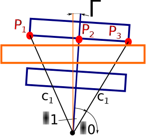
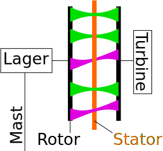
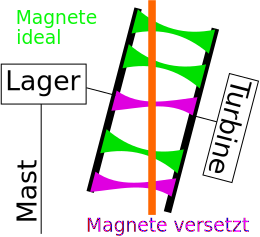

# Descripton and effects of the rotor deviation

<!--- Piture Airgap  -->

Members of the Wind Empowerment Community told me about bearing problems appearing after long operating times. In particular is the loosening of the bearing screw a severe failure. When this screw gets loose the rotor of the wind turbine bents down towards the ground. But it will move only a little bit, because very soon the rotor's magnets will touch the stator. Then when the wind turbine starts turning, the sharp edges of the magnets will destroy the thin isolation of stator.

  # Rotor Deviation vs. Stator Deviation
  In the following the described failure is called rotor deviation. 

<!--- Rotor Deviation Picture Laboratory -->

<!--- Stator Deviation  -->

<!--- Rotor Deviation  -->

<!--- Flux parallel  -->

<!--- Flux Rotor Deviation  -->

