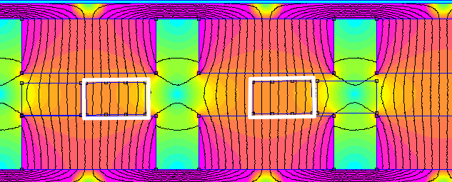
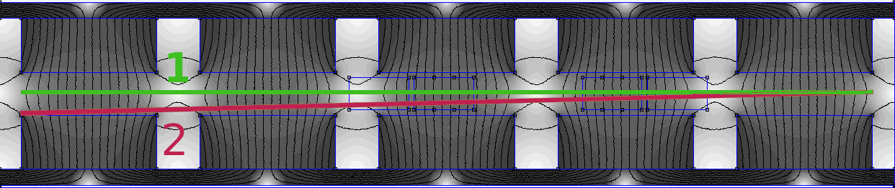
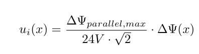

# FEMM Simulation of the Piggott APSM Generator

Before the the test stand was build up, a simulation was done to get get a better understanding of the magnetic circuit in the APSM. A 2D Simulation along the circumference of the machine was made with [FEMM](https://www.femm.info/).
The first outcome of the simulation is the knowledge about the double cone shape of the flux density distribution in the airgap between the rotor disks. 

Secondly the flux linkeage in one coil was simulated along its way whith and without rotor deviation.

With this flux linkeage data the induced voltage is approximated in the [notebook](./FEMM_Simulation/Auswertung_2F12P.ipynb).

