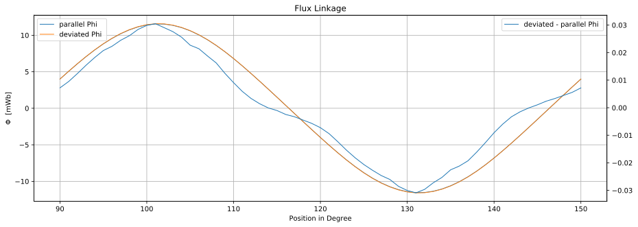

# FEMM Simulation of the Piggott APSM Generator

Before the the test stand was build up, a simulation was done to get get a better understanding of the magnetic circuit in the APSM. A 2D Simulation along the circumference of the machine was made with [FEMM](https://www.femm.info/).
The first outcome of the simulation is the knowledge about the double cone shape of the flux density distribution in the airgap between the rotor disks. 

Secondly the flux linkeage in one coil was simulated along its way whith and without rotor deviation.

When the coils are closer to the magnets, the flux density is higher:

## Effects on the induced Voltage
The flux linkeage of an inclined coil close to the magnets shows the following chart:

With this flux linkeage data the induced voltage is approximated in the [notebook](./FEMM_Simulation/Analysis_2F12P-FluxLinkage.ipynb).
The focus here is on the change of the induced voltage when the geometry is altered and not on the absolute voltage amounts. Later on the terminals voltage is analyzed and in this section only one coil is analyzed. There is no contradiction because the shape of the sinusoidal terminal voltage curve is the same as the coil voltage curve. But the terminals voltage amplitude and phase is diffrent to the voltage induced in the coils (Hint: 1*exp(j0)+1*exp(j120°)=1/2*exp(j60°) ). 

For having the same levels as the original generator, the simulated induced voltage values are converted to the generator nominal voltage:

The chart shows the difference between the induced voltage when the rotor is deviated and in the failure free position. One can see, that the similarity to the third harmonic. Later on in the experiments it is shown that the 3rd harmonc increases when the rotor is deviated.

All in all does the simulation show that the harmonic content of the induced voltage increases when the coils are closer and inclined to the magnets.

