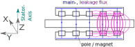

# Stray Magnetic Field Analysis

Around the APSM Generator exists a stray magnetic field, which is caused by the permanent magnets on the rotor disks. So it moves with the magnets when the rotor revolves. The leakage flux is the part of the magnetic flux, that doesn't pass the coils as the main flux do.

The aim of the experiment was to figure out, whether the leakage flux is a suitable input quantity to detect the rotor deviation with today's low cost hardware.
Therefore the magnetic flux density was measured with a 3D Hall-Sensor GY-271 which was positioned on the edge if the stator housing.

On the picture the one can see the APSM Generator and the Hall Sensor, which is fixed with a yellow tape. For the measurements the rotor is turned with a slow velocity by hand. When the rotor deviates caused by a loosened bearing screw, the angle of inclination is approx. 1 degree. And so the stray field also deviates by 1 degree. As comparison experiment the Hall Sensor was lifted with a cable tie (on the picture) which equals the move of the stray field when the rotor is deviated.

In the python [notebook](./Stray_Field_Analysis/MagneticStrayFieldAnalysis.ipynb) the measurement results of the Hall Sensor are visualized.
On the following charts two revolutions are plotted. One can count 2x6 Maxima ox the flux density in the Z-Direction. The amount of flux density varies between the poles due to constructional inaccuracies.

As shown in the following charts can the rotor deviation be dected with this cheap hall sensor.

But the calculation of the deviation angle is not trivial because of the curved shape of the magnetic field lines. The triangular calculation approach in the notebook fails.
Therefore some smart algorithms are needed.