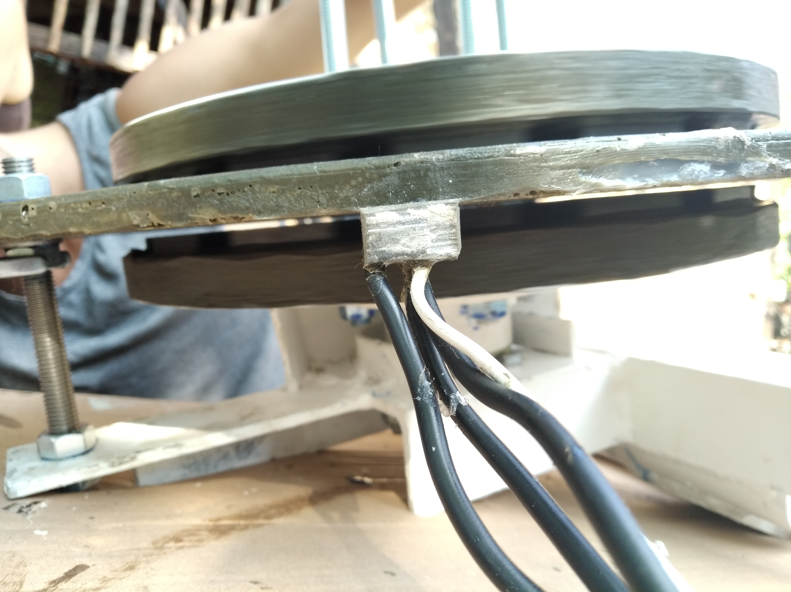
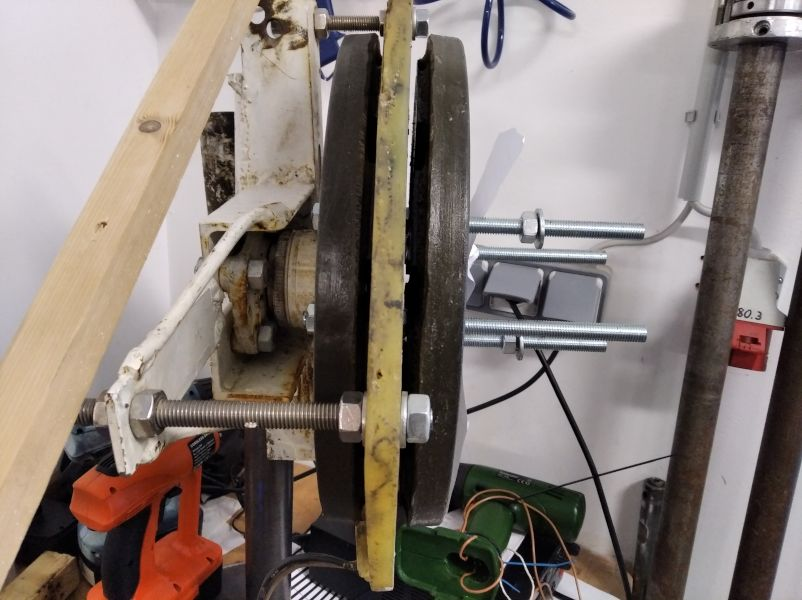
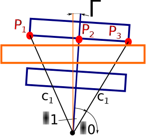
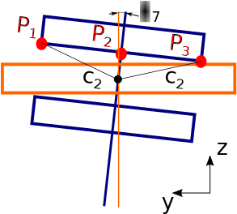
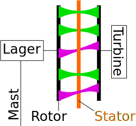
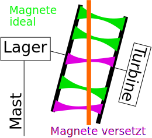
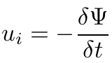

# Description and effects of the rotor deviation

<!--- Piture Airgap  -->

Members of the Wind Empowerment Community told me about bearing problems appearing after long operating times. In particular is the loosening of the bearing screw a severe failure. When this screw gets loose the rotor of the wind turbine bents down towards the ground. But it will move only a little bit, because very soon the rotor's magnets will touch the stator. Then when the wind turbine starts turning, the sharp edges of the magnets will destroy the thin isolation of stator.

## Rotor Deviation vs. Stator Inclination
In the following the described failure is called rotor deviation. The drawing shows the APSM with the pivot point in the bearing, the blue colored rotor and the orange colored stator.

<!--- Rotor Deviation Picture Laboratory -->

<!--- Rotor Deviation  -->

If you want to loose the bearing screw manually it needs some time because you have to disassemble the front rotor magnet disk. A more easy way is to deviate the stator by adjusting the nuts. I called this stator inclination. The pivot point is then located in the middle of the stator. In consequence the geometry of the stator inclination differs in several ways from the rotor deviation! Mainly because when the rotor is deviated its vertical position is 1 mm below the original state.
<!--- Stator Deviation  -->

## Effects of the rotor deviation on the terminals voltage
The following drawing shows simplified the flux density in the airgap of the APSM. The green colored flux is caused by ideal parallel positioned magnets. The violet colored flux is caused by misaligned magnets.

<!--- Flux parallel  -->

The next drawing shows the position of the stator in the magnetic field when the rotor is deviated. The flux density in the coil area is altered. Especially in the area of the upper and lower coils. 
<!--- Flux Rotor Deviation  -->

When the wind turbine is rotating the magnetic flux caused by the magnets passes the stator's coils with the rotor's velocity. The change of the flux linkage in each coil induces the voltage. According to Faraday's law is the induced voltage proportional to the change of the flux linkage over time:
<!--- Flux Rotor Deviation  -->

When the rotor is deviated the flux density in the area of the coils differs to the original state. This leads to an altered flux linkage curve and an altered voltage curve. Due to the vertical misalignment of the rotor to the stator the overall amount of to the flux linked to the coils is lower. That's why the voltage RMS value is reduced in case of rotor deviation.

Another approach for the detection of the rotor deviation is to analyse the timestamps of the **voltage zero crossing (ZC)**. In theory the time of the Voltage ZC changes when the rotor is deviated. The cause can be explained when one looks at the voltage induced in one coil. The voltages ZC happens when the amount of flux linkage is maximal, because then the flux linkage time derivative equals zero when it changes its sign. If the rotor is deviated the radial position of one's coil flux linkage direction changes. Especially when one pole's two magnets on the two rotor disks are not positioned ideally parallel. In the drawing the violett flux linkage shows this case.
