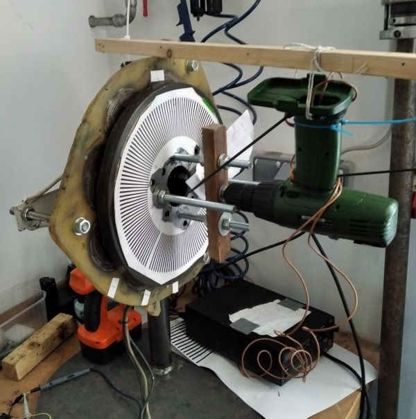
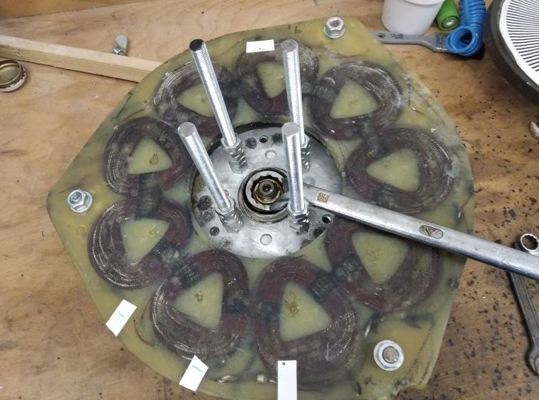

# Description of the Test bench

The aim is to perform measurements with a deviated rotor and a rotor in the failure free normal position.
Therefore the generator is mounted on a welded steel stand. The generator is then in the same position as on the wind turbine's tower.

The rotor deviation is achieved by loosening the bearing screw manually.

## The APSM Generator
The APSM is the Piggott 2F12P model:
+ P_N= 500 W
+ U_N= 24 V @ n_N=210 rpm
+ 12 Poles, 24 Ferrite Magnets
+ 12 Coils, 1.6mm Cu wire, 3 coils per line, star connection

## Measuring Equipment
The following Equipment for measuring the voltage are used:
+ Oscilloscope Keysight InfiniiVision 2000
+ Mikrocontroller ESP8266 

### Oscilloscope
The Oscilloscope is directly connected to the APSM terminals: GND - L1, Ch1 - L2, Ch2 - L3.
In case of Measurements with decreasing rotational speed, the Oscilloscope is triggered by the ESP8266. The Mikrocontroller calculates the speed by measuring the frequency and triggers the Oscilloscope when the speed falls under a predefined value.

## Voltage Zero-Crossing (ZC) Detection
The aim of this microcontroller circuit is to measure the roational speed with high accuracy. The analysis of this data also leads to the approach to detect the rotor deviation on the basis of ZC time differences. The hardware components are:
* ESP8266 Microcontroller
* bridge rectifier
* [constant power source circuit](http://www.dieelektronikerseite.de/Pics/Lections/Konstantstromquelle%20-%20Immer%20das%20Gleiche%20S01.GIF)
* optocoupler
* **Bild Schaltplan**

## Auxiliary Generator drive
The Generator is driven by a DC-Motor, which is power by a laboratory DC power supply. The speed can be adjusted by altering the DC supply voltage. For the sake of simplicity an old cordless screw driver with a DC Motor has been used. 

