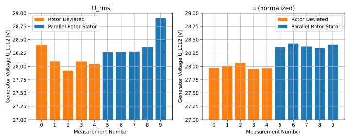
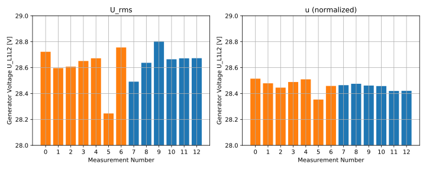
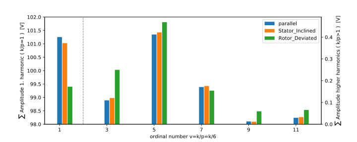
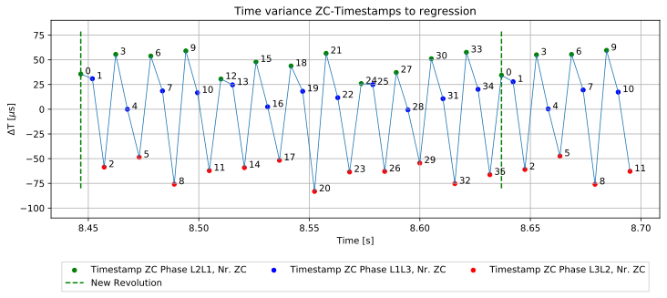

# Analysis of the Generator Voltage with deviated rotor

In this file the effects of the rotor and stator deviation on the induced terminals voltage will be described. The analysis is based on oscillograms of the APMS voltage which is induced when the rotor is driven with constant speed.

## Effective RMS Value
When the rotor is deviated, the flux linkage is reduced. The consequence is a lower voltage amplitude. This is confirmed by the measurement series. The voltage drops approx. 0.4 V when the bearing screw is loose, as calculated [here](./Voltage_Analysis/RotorDeviation_URMS_nconst.ipynb).

When the stator is inclined, there could be no significant variation of the effective voltage value be observed. [Link](./Voltage_Analysis/StatorInclination_URMS_nconst.ipynb) to the notebook.

## Fourier Analysis

The shape of the generator terminals voltage curve is not a perfect sinus curve and alters its shape when the rotor is deviated. For the description of the voltage curve's shape the Fourier Transformation (FT) is used.

Formula from [wikipedia](https://en.wikipedia.org/wiki/Fourier_analysis) .

For the interested reader I want to explain the core principal behind the FT. In our case, s(t) is the recorded voltage signal. This voltage signal will then be multiplied by a perfect sinus wave with the frequency f. The perfect sinus wave is given in form of the complex function exp(-j2pi*f*t). This calculation will be made with many frequencies. When the measured signal equals one sinus function with the frequency f1 the result S(f1) will be a high value. When there are only a few matches with the frequency f2 the result (sum) S(f2) will be very little. The spectrum shows all the sums S(f).

In the laboratory four measurement series were recorded. The first one with the failure free parallel positioning of rotor and stator. Then the bearing screw was loosened, the rotor deviated and a second series was recorded. Two days later the bearing screw was tightened again and a third series was recorded. For the last recording the stator was inclined by varying the position of the nuts. For each arrangement five scope recordings were made and analyzed. The rotor speed was kept constant.

With the numpy fft function the voltage signal was analyzed. Due to the slightly different rotor speed the spectra of each arrangement are not identical. For a better comparability the frequency scale is transformed to the ordinal number of the harmonics. Then the values are grouped into frequency bins with a bin-width around 5 Hz.

* [Notebook Rotor Deviation](./Voltage_Analysis/RotorDeviation_FFT_nconst.ipynb)
* [Notebook Stator Inclination](./Voltage_Analysis/StatorInclination_FFT_nconst.ipynb) 

*Results*: With the measurements it is proved that the harmonic content increases when the rotor deviated. Especially the Amplitudes of the 3rd, 5th and 9th harmonic are increased.

## Voltage Zero Crossing Time Analysis
Another approach for the detection of the rotor deviation is to analyse the timestamps of the *voltage zero crossing (ZC)*. In theory the time of the Voltage ZC changes when the rotor is deviated. The additional hardware is described *here*. On the one hand is the advantage of this method the simple and cheap hardware setup. On the other hand is the analysis a way more complicated. Within this work a change of the ZC timestamps could not be shown. In the 'ZC lines' file are the timestamps from the ESP8266 stored, which were sent to an computer. The timestamps of the ZC between all three lines were recorded. Then the Python notebooks were used to visualize the time differences. For this the time differences between each timestamp were calculated. Then a regression was made to have an estimated time for each ZC-Event. The difference between the regression and the measured timestamp is then visually analyzed. 

The 

