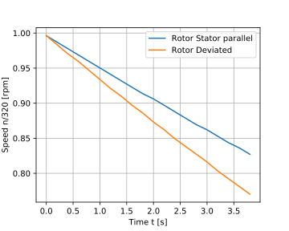
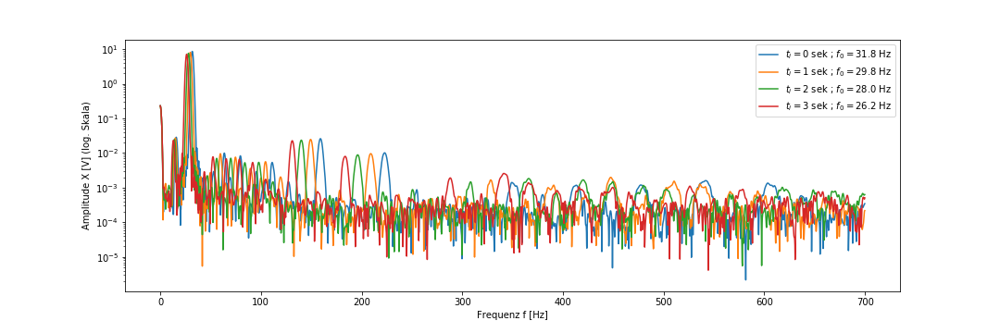
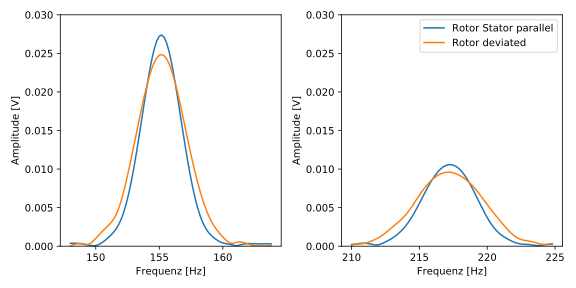
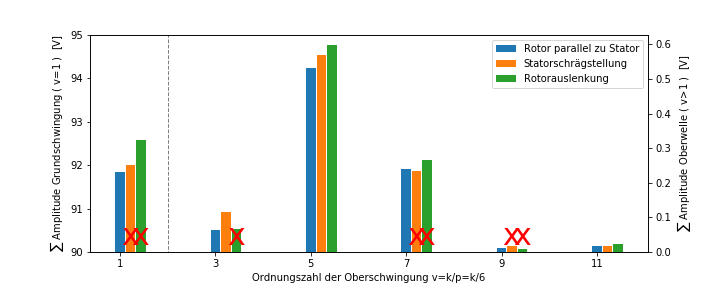

# Voltage Analysis with decreasing rotor speed
In the [previous chapter](./VoltageAnalysis.md) the voltage was analyzed with constant rotor speed. But in reality the speed of the wind turbine's rotor is variable and depends on the wind speed and load. In consequence the voltage analysis methods need to be improved, so that they can be applied on a voltage signal with variable frequency and amplitude.

Within the Master thesis the voltage signal of the Generator with decreasing Speed was analyzed. Therefore the Rotor was accelerated and then run down without any load.
In this process it was found that the friction in the bearing increases when the rotor is deviated. In consequence is the speed reduction resp. the rate of the electrical frequency decrease higher if the rotor is deviated. So the complexity of the Analysis increases because the voltage signals are not easily comparable. 

## RMS Voltage Analysis

The RMS voltage was analyzed by comparing the RMS value of short intervals with the same average frequency. Unfortunately could the voltage decrease not be proven.

* [notebook](RotorDeviation_URMS_ndec.ipynb)

## Fourier Analysis

When the rotor speed is decreasing the electrical frequency decreases in same amounts. This leads to a shift in the frequency spectrum in the direction of lower frequencies, as shown in the following chart:

The chart shows the spectrum of the Generator voltage. The spectrum is the result of four Short-Time-FT over a time span of 1 second.

The increased deceleration of the rotor speed when the rotor is deviated alters the shape of the peaks in the spectrum:

The reason is, that the FT time interval (1 sec) had not been altered. In case that the friction is higher the frequency change is also higher. And this reflects the spectrum.
This effect is gaining importance the higher the observed frequencies are, because the frequency change is higher.
When one wants to sum up the spectrum into bins with a fixed with as it was done before, the results aren't representative anymore for all harmonics.
The following chart shows the results of the STFT with decreasing speed. The tendency of the red crossed bars is different to the analysis results with constant speed.

( Statorschrägstellung = Stator Inclination ; Rotorauslenkung = Rotor Deviation; Ordnungszahl = harmonic)

### Results
As shown in the chart can the rotor deviation be detected with the attached algorithm and a focus on the 3rd and 5th harmonic. 

## Ideas for the improvement of the Algorithm
* automatic variation of the bin width
* adjusting the FT time interval
